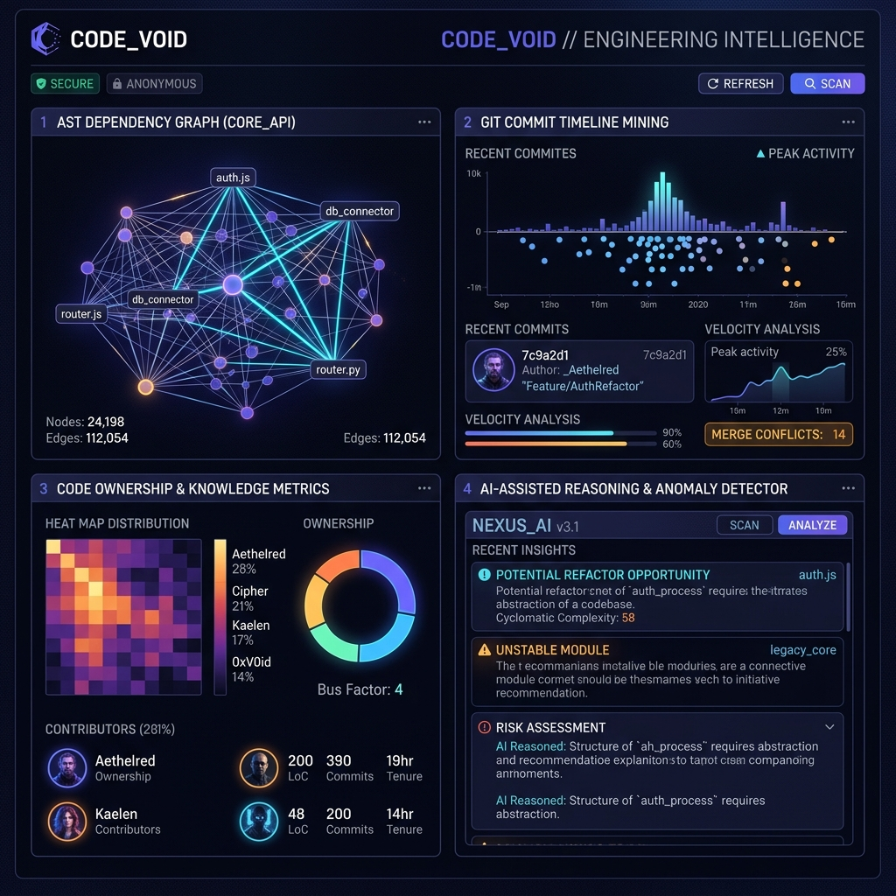
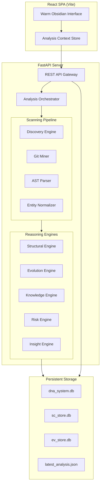

# 🧬 Project DNA

> **Decoupled Network Analysis & Architectural Reasoning Engine**

Project DNA is a production-grade static codebase analysis and architectural reasoning platform. It parses source files into detailed Abstract Syntax Tree (AST) entity graphs, correlates structural metrics with Git operational history, and runs deterministic reasoning algorithms to discover structural risks, design cycles, knowledge siloing, and AI-driven refactoring paths.



---

## 🚀 Key Capabilities

* **📊 Multi-Language AST Parsing**: Supports Python, JavaScript, TypeScript, Go, and Rust. Parses declarations, function definitions, classes, and import/require statements into unified semantic nodes.
* **📈 Git History Mining**: Computes change frequency, author ownership, code churn, and contributor timelines over deep Git structures.
* **⚡ Dependency Graph Workspace**: Renders and visualizes interactive 2D node-link import trees to trace structural cycles.
* **🧩 Knowledge Map & Bus Factor**: Analyzes contributor commits to discover silos, compute bus factors, and highlight risk dependencies.
* **🛠️ Refactoring Execution Pipeline**: Generates step-by-step decoupling roadmaps and tracks execution state (pending, running, success).
* **🧠 AI assistant**: Resolves natural language developer queries against parsed graphs and evidence facts deterministically.

---

## 🏛️ System Architecture



---

## 📂 Repository Structure

```
├── backend/            # FastAPI REST backend and reasoning engines
│   ├── dna/
│   │   ├── api/        # Routers and controllers (entities, evidence, reviews, system)
│   │   ├── storage/    # SQLite store engines (system.py, store.py)
│   │   ├── engines/    # Analysis processors (structural, evolution, knowledge, risk)
│   │   └── reasoning/  # Logic insight generation engines
├── frontend/           # Vite React SPA (Warm Obsidian Design System)
│   ├── src/
│   │   ├── pages/      # Dashboard, Explorer, RiskCenter, Reviews, settings, Admin
│   │   ├── services/   # api.js client gateway
│   │   └── store/      # React state provider
├── tests/              # Multi-stage integration and unit test suite
├── docs/               # System documentation and assets
├── requirements.txt    # Python dependencies
└── package.json        # Frontend workspace configuration
```

---

## 🛠️ Quick Start

### 1. Prerequisites
Ensure you have Python 3.10+ and Node.js 18+ installed on your system.

### 2. Start Backend Server
```bash
# From the root directory
pip install -r requirements.txt
python -m uvicorn dna.api.app:app --host 0.0.0.0 --port 8000 --reload
```

### 3. Start Frontend Dev Server
```bash
# In another terminal window
cd frontend
npm install
npm run dev
```
Open [http://localhost:5173](http://localhost:5173) in your browser.

---

## 🧪 Testing

Run the full integration test suite containing 360+ tests:
```bash
python -m pytest tests/ --ignore=tests/_perf_target
```

--

## ⚖️ License
Proprietary engineering asset under Project DNA Core. All rights reserved.
