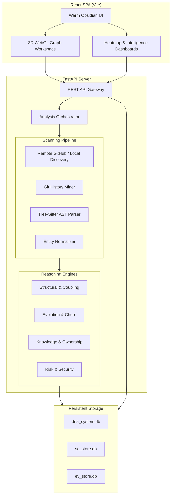

# 🧬 Project DNA

> **Enterprise Codebase Intelligence & Architectural Reasoning Platform**

Project DNA is a production-grade static codebase analysis and architectural reasoning platform. It parses source code into intricate Abstract Syntax Tree (AST) entity graphs, correlates structural metrics with deep Git operational history, and uses deterministic reasoning algorithms to discover structural risks, design cycles, knowledge silos, and AI-driven refactoring paths.

   

---

## 🚀 Key Features

* **🌐 3D Architecture Globe**: Navigate your entire codebase in a fully interactive, force-directed 3D WebGL environment. Visualize dependency links, circular cycles, and class hierarchies dynamically.
* **📊 Six Production-Grade Heatmaps**:
  * **Git Intelligence Center**: A beautiful Bento Box dashboard visualizing Commit Timelines, Author Collaboration Networks, Hot/Unstable Files, and Abandoned Modules.
  * **Complexity Heatmap**: Pinpoint cognitive and cyclomatic complexity hotspots down to the exact function line.
  * **Risk Heatmap**: An aggregated composite score of churn, complexity, and security vulnerabilities.
  * **Coupling & Dependency Heatmaps**: Detect monolithic architectural flaws and excessive fan-in/fan-out metrics.
  * **Ownership Heatmap**: Calculate Bus Factor risk and identify single points of failure in team knowledge.
* **🔍 Multi-Language AST Parsing**: Full parsing support for Python, JavaScript, TypeScript, Go, and Rust using advanced `tree-sitter` integration.
* **🤖 AI-Driven Insight Interpretation**: Every heatmap and graph node features an AI-generated natural language explanation, detailing exactly *why* a metric is flagged and *how* to fix it.
* **☁️ GitHub Native Integration**: Seamlessly fetch, clone, and analyze remote GitHub repositories directly from the dashboard.

---

## 🏛️ System Architecture



---

## 📂 Repository Structure

```text
├── backend/            # FastAPI REST backend and reasoning engines
│   ├── dna/
│   │   ├── api/        # Routers and endpoints (heatmaps, github, analysis)
│   │   ├── storage/    # SQLite store engines for entities and evidence
│   │   ├── engines/    # Core analysis processors (structural, risk, git)
│   │   └── parser/     # Tree-sitter AST traversal and parsing logic
├── frontend/           # Vite React SPA (Dark Mode Obsidian Design System)
│   ├── src/
│   │   ├── pages/      # 3D Graph Workspace, Heatmaps, Git Intelligence, Dashboard
│   │   ├── components/ # Reusable UI components (Bento Boxes, Metrics)
│   │   └── services/   # Axios API client gateways
├── tests/              # 360+ Integration and Unit tests (Pytest)
├── requirements.txt    # Python backend dependencies
└── package.json        # Frontend workspace configuration
```

---

## 🛠️ Getting Started

### 1. Prerequisites
* **Python 3.10+** (Required for AST parsing and FastAPI)
* **Node.js 18+** (Required for the Vite + React frontend)
* **Git** (Required for GitHub remote repository cloning)

### 2. Backend Setup
```bash
# Clone the repository
git clone https://github.com/itripathiharsh/Project-s-DNA.git
cd Project-s-DNA

# Install Python dependencies
pip install -r requirements.txt

# Start the FastAPI server (Runs on port 8000)
python -m uvicorn dna.api.app:app --host 0.0.0.0 --port 8000 --reload
```

### 3. Frontend Setup
```bash
# Open a new terminal window
cd frontend

# Install Node dependencies
npm install

# Start the React development server
npm run dev
```
Open [http://localhost:5173](http://localhost:5173) in your browser. (Note: The backend defaults to port 8000).

---

## 🎮 How To Use

1. **Onboarding**: When you open the platform, you will be greeted by the Onboarding screen. You can either provide a local directory path (e.g., `/var/www/html/my-app`) or paste a **public GitHub URL** (e.g., `https://github.com/user/repo`).
2. **Analysis Phase**: Click "Run Full Analysis". The backend orchestrator will pull the code, map the AST, mine the Git history, and run the reasoning engines. This may take a minute for large repositories.
3. **Explore the 3D Graph**: Navigate to the **Architecture Graph** in the sidebar. Use your mouse to rotate, zoom, and drag the 3D globe. Use the top filters to view Circular Cycles or Database Models. Click on any node to view its structural properties and coupling dependencies.
4. **Review Heatmaps**: Open the **Git Intelligence Center** or the **Risk Heatmap** to see detailed chronological breakdowns, team collaboration networks, and AI-interpreted risk summaries.

---

## 🧪 Testing

Project DNA includes a massive automated test suite covering parsing, orchestration, and API routing.

```bash
# Run the full integration suite
python -m pytest tests/ --ignore=tests/_perf_target
```

---

## 🚀 Deployment

* **Frontend**: Automatically deployed via **Vercel**.
* **Backend**: Automatically deployed and hosted via **Render**.

Changes pushed to the `main` branch of this repository will trigger seamless, zero-downtime redeployments across both cloud providers.

---

## ⚖️ License
Proprietary engineering asset under Project DNA Core. All rights reserved.
