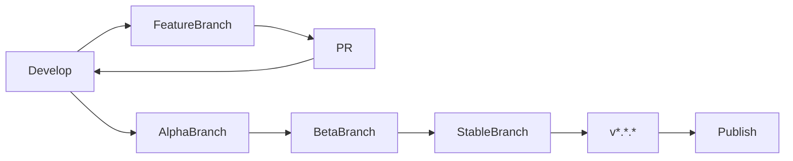

================================================================================
# 07 Release Strategy
================================================================================

# Release Strategy

## Purpose

The release strategy defines how Project DNA versions are numbered, what each release contains, and how releases are distributed and communicated to users.

---

## Versioning

Project DNA follows [Semantic Versioning 2.0.0](https://semver.org/):

| Component | When to Increment |
|---|---|
| MAJOR | Breaking API changes, major architectural overhaul |
| MINOR | New features, non-breaking API additions |
| PATCH | Bug fixes, performance improvements, documentation |

Pre-release identifiers: `-alpha.N`, `-beta.N`, `-rc.N`

## Release Channels

| Channel | Frequency | Audience | Stability |
|---|---|---|---|
| `nightly` | Daily | Internal developers | Unstable |
| `alpha` | Weekly | Early testers | May break |
| `beta` | Monthly | Open testers | Feature-complete |
| `stable` | Quarterly | All users | Production-ready |

## Release Process

1. Features are developed on branches and merged to `develop` via PR
2. `develop` is promoted to `alpha` branch weekly
3. `alpha` is promoted to `beta` branch monthly after stabilization
4. `beta` is promoted to `stable` quarterly with a version tag
5. The tag triggers CI/CD publication to npm, Docker Hub, GitHub Releases

## Release Notes

Every stable release must include:

- Title: `Project DNA v1.2.3`
- Section: **New Features** (user-facing changes)
- Section: **Improvements** (performance, UX, reliability)
- Section: **Bug Fixes** (issues resolved)
- Section: **Breaking Changes** (migration steps)
- Section: **Known Issues** (open bugs)
- Link to full changelog
